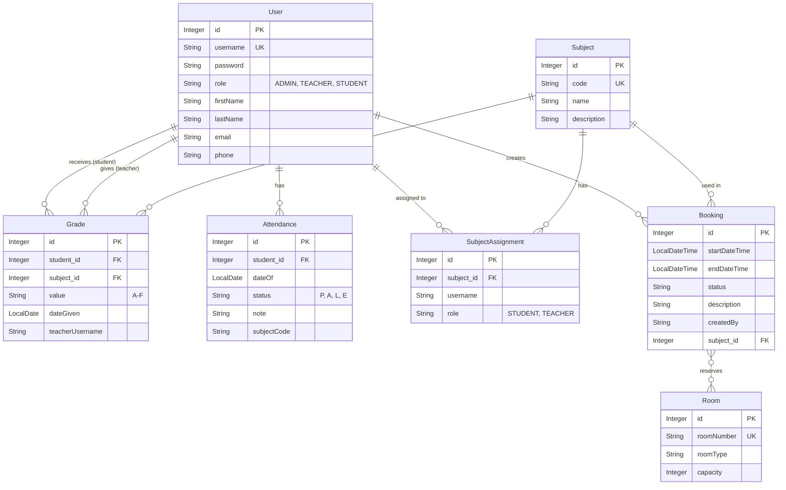

# Verdan University Manager


**Verdan** is a comprehensive university management system with a **React web app** client connected to a **REST API** powered by Javalin, with **MySQL** for persistence.

## 🚀 Key Features

* **React Web App:** Modern dark-theme client built with React 19 + TypeScript.
* **Role-Based Access Control (RBAC):** Distinct interfaces and permissions for Admins, Teachers, and Students.
* **User Management:** Unified system for managing all user types securely.
* **Course Management:** Create and manage subjects/courses and assign teachers/students.
* **Grading System:** Teachers can register grades; students can view their own academic progress.
* **Attendance Tracking:** Register and track student attendance per subject.
* **Room & Booking Management:** Manage classrooms and schedule exams/lectures with conflict detection.
* **Reporting:** Generate visual reports of grades and absence statistics (exportable to CSV).
* **REST API:** Full CRUD API with JWT authentication, refresh tokens, and rate limiting.
* **API Documentation:** Interactive Swagger UI at `/swagger`.
* **CI/CD Pipeline:** Automated build and test via GitHub Actions.

## Tech Stack

### Backend
* **Language:** Java 21
* **REST API:** Javalin 6.4 + Jackson
* **Authentication:** JWT (java-jwt) + BCrypt password hashing
* **Build Tool:** Maven
* **Database:** MySQL 8.0 (via Hibernate ORM)
* **Persistence:** Jakarta Persistence (JPA) / Hibernate 6.5
* **Logging:** SLF4J / Logback with MDC

### Frontend (Web)
* **Framework:** React 19 + TypeScript
* **Bundler:** Vite 8
* **Routing:** React Router v7
* **Data Fetching:** TanStack Query v5
* **Styling:** Tailwind CSS v4 (dark theme)
* **HTTP Client:** Axios with JWT interceptors
* **Icons:** Lucide React

## Installation & Setup

### Prerequisites
* Java JDK 21 or higher
* Maven
* Node.js 18+ (for React frontend)

### How to Run with Docker (Full Stack)
The entire system (MySQL + API + React frontend) can be deployed with one command:
```bash
docker-compose up -d --build
```
* **React Web App:** `http://localhost:4000`
* **REST API:** `http://localhost:8081`
* **Swagger UI:** `http://localhost:8081/swagger`
* MySQL is started automatically and data is persisted in a Docker volume

### How to Run Locally (Command Line)

**1. Start Database First!**
The application requires a MySQL database. Start it via Docker:
```bash
docker-compose up -d mysql-db
```

**2. Start the REST API (in a separate terminal):**
```bash
mvn compile exec:java
```

**3. Start the React Web App (in a separate terminal):**
```bash
cd verdan-web
npm install
npm run dev
```
Open `http://localhost:5173` in your browser.

### How to Run (Eclipse)

1.  **Import Project:**
    * File > Import > Maven > Existing Maven Projects.
    * Select the project folder.
2.  **Update Dependencies:**
    * Right-click project > Maven > Update Project... (Check "Force Update").
3.  **Run the API:**
    * Locate `src/main/java/no/example/verdan/api/ApiServer.java`.
    * Right-click > Run As > Java Application.

### How to Run Tests
The project contains unit, integration, and security tests. Run them using:
```bash
mvn test
```

> **Note on Database:** The application uses **MySQL**. If you run the API locally via Maven, ensure you either have a local MySQL server running on port 3306, or start the Docker MySQL service (`docker-compose up -d mysql-db`) first. The database schema will be auto-generated by Hibernate.

## Login Credentials (Demo Data)

The system comes pre-loaded with the following users for testing:

| Role | Username | Password |
| :--- | :--- | :--- |
| **Administrator** | `admin` | `admin123` |
| **Teacher** | `teacher` | `teacher123` |
| **Student** | `student` | `student123` |

## REST API Endpoints

Base URL: `http://localhost:8081` (Docker) / `http://localhost:8080` (lokal)

📖 **Full interactive API documentation:** [http://localhost:8081/swagger](http://localhost:8081/swagger)

| Method | Endpoint | Description | Access |
| :--- | :--- | :--- | :--- |
| POST | `/api/login` | Authenticate & get JWT + refresh token | Public (rate limited) |
| POST | `/api/auth/refresh` | Refresh expired access token | Public |
| GET | `/api/health` | Health check | Public |
| GET | `/api/openapi.json` | OpenAPI 3.0 specification | Public |
| GET/POST/PUT/DELETE | `/api/users` | User management (Supports `?role=STUDENT`) | ADMIN |
| GET/POST/PUT/DELETE | `/api/subjects` | Subject management | ADMIN (write) |
| GET/POST/PUT/DELETE | `/api/grades` | Grade management | ADMIN/TEACHER |
| GET/POST/PUT/DELETE | `/api/attendance` | Attendance management | ADMIN/TEACHER |
| GET/POST/PUT/DELETE | `/api/rooms` | Room management | ADMIN (write) |
| GET/POST/DELETE | `/api/bookings` | Booking management | ADMIN/TEACHER |

> All endpoints (except public ones) require a JWT access token in the `Authorization: Bearer <token>` header.
> Access tokens expire after 15 minutes. Use the refresh endpoint to get a new token pair.

## Database Architecture

The application uses a relational database model managed by Hibernate ORM. Below is an Entity-Relationship (ER) diagram showing the schema:



## Project Structure

The project follows a layered architecture with clear separation of concerns:

```
┌───────────────────┐
│   React Web App   │
│   (verdan-web/)   │
└────────┬──────────┘
         │
         ▼
┌──────────────────────────────────────────────┐
│              REST API (Javalin)              │
│  Controller → Service → DAO → Hibernate/DB  │
└──────────────────────────────────────────────┘
```

### Backend (Java)
* `no.example.verdan.model` - JPA entities representing database tables
* `no.example.verdan.dao` - Data Access Objects handling database transactions
* `no.example.verdan.dto` - Data Transfer Objects for API request/response
* `no.example.verdan.service` - Business logic, validation, and error handling
* `no.example.verdan.api` - REST controllers, middleware, and metrics
* `no.example.verdan.auth` - Authentication logic (BCrypt)
* `no.example.verdan.security` - JWT utilities, input validation, rate limiting

### Frontend (React)
* `verdan-web/src/api/` - Axios API client with JWT auto-refresh
* `verdan-web/src/auth/` - Auth context, protected routes, role guards
* `verdan-web/src/components/` - Reusable UI components (sidebar, tables, modals)
* `verdan-web/src/pages/` - Page components for each feature module
* `verdan-web/src/types/` - TypeScript types matching backend DTOs

---
*Developed by Group 2 - Fall 2025*